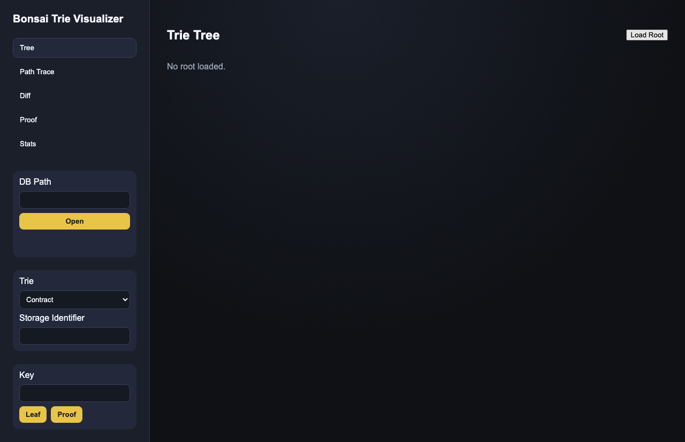
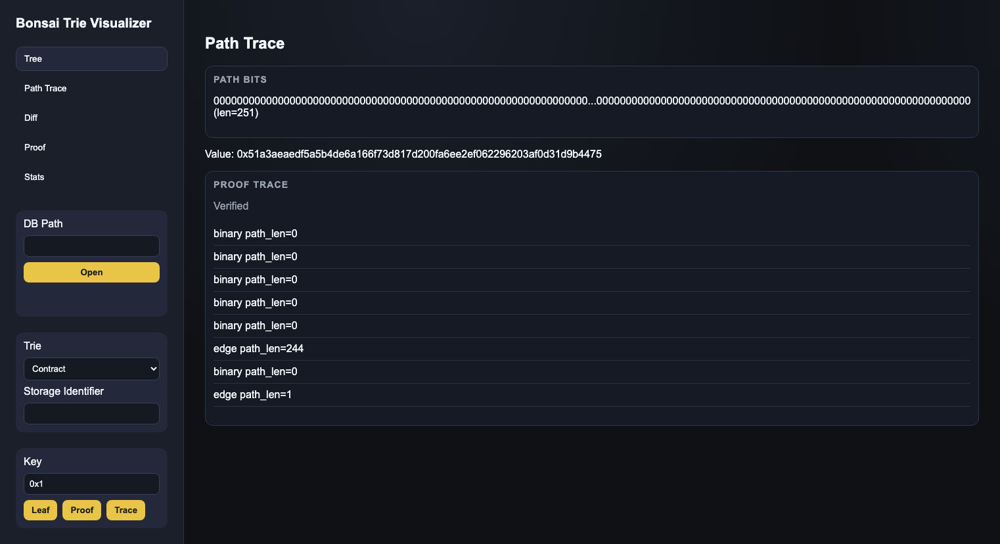
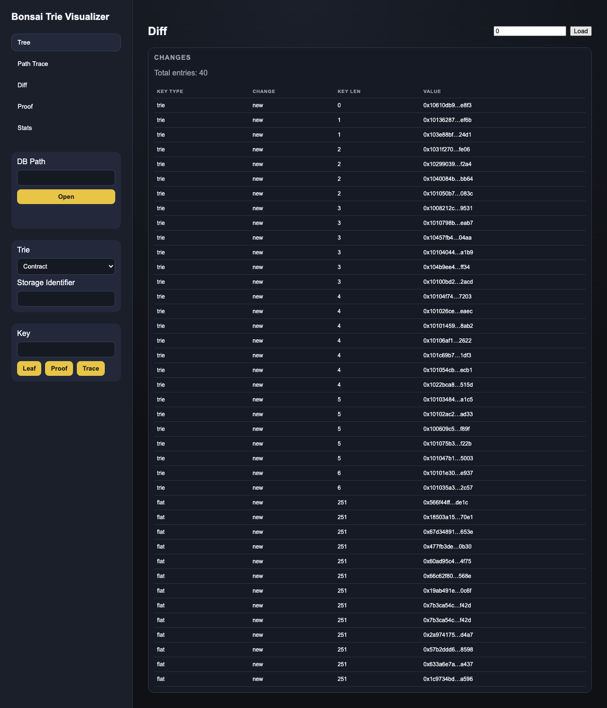
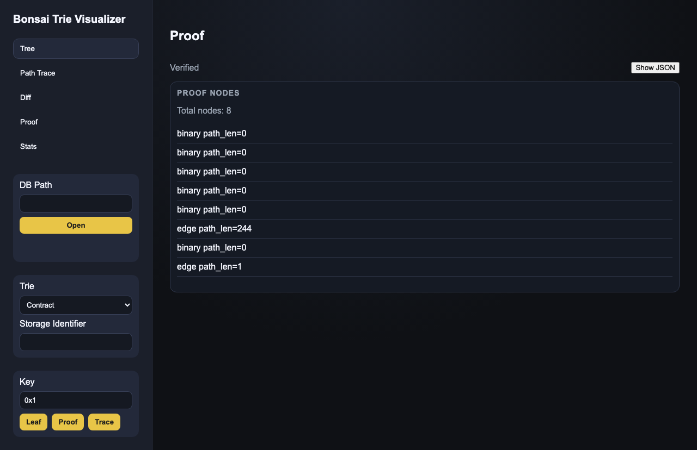
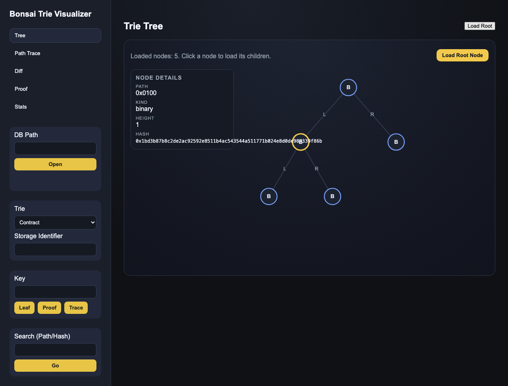

# Bonsai Trie Visualizer

Rust-native visualizer for Madara's Bonsai-backed Merkle Patricia tries.

## Usage

Backend (Axum) runs on port 4010, frontend (Trunk) on 4011 to avoid conflicts.

```bash
# API server
cargo run -p bonsai-api -- --db-path /tmp/madara_devnet_poc_v2/db --port 4010

# Frontend (new shell)
trunk serve --port 4011
```

Open `http://127.0.0.1:4011`.

## Notes

- DB must include all Madara column families; the API validates Bonsai columns on open.
- Storage trie requires a contract address (felt) as the identifier.

See `PLAN.md` for the roadmap and workflow.

## Screenshots

Graph view with expansion:


Path trace:


Diff view:


Proof view:


Search:


Final overview:

